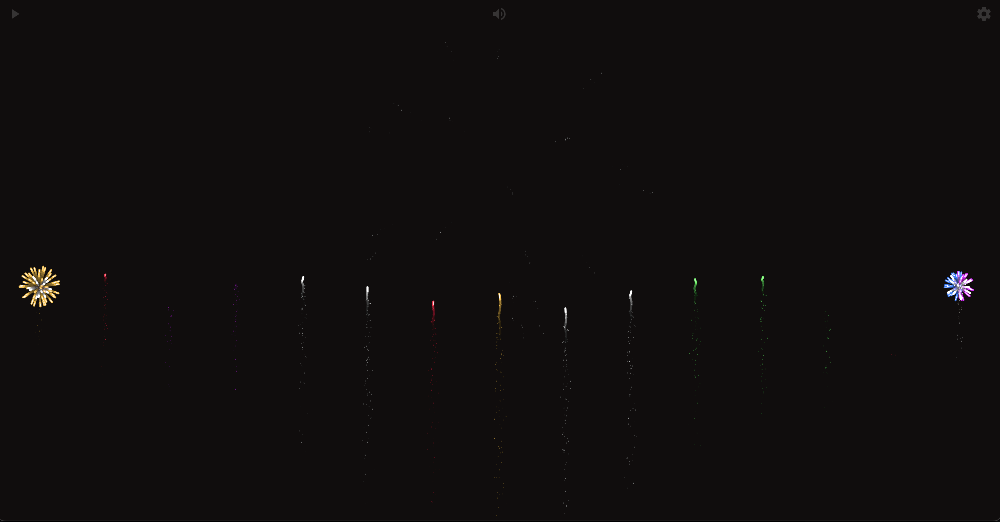

# New-Year-Fireworks

Celebrate the New Year with spectacular fireworks! This project is a vibrant and dynamic visualization of fireworks designed to bring joy and excitement to your screen as you welcome the upcoming year.

## Features

- **Realistic fireworks effects**: Explosions, streaks, and colorful flashes mimic real-world fireworks.
- **Interactive Display**: Users can click or tap to launch their own fireworks.
- **Sound**: Users can hear very realistic and vivid fireworks sounds.

## Demo

Check out a live demo here: [New-Year-Fireworks Demo](https://dangtiendung1409.github.io/New-year-fireworks/) *(Replace with the demo link)*

## Installation

Clone this repository to your local machine:

```bash
git clone https://github.com/dangtiendung1409/New-year-fireworks.git
cd New-year-fireworks
```

Open the `index.html` file in your browser to view the fireworks display.

## Usage

1. Open the project in a browser.
2. Click or tap on the screen to launch fireworks.
3. Enjoy the show!

## How It Works

This project is built using:

- **HTML**: For the structure of the page.
- **CSS**: To style the display.
- **JavaScript**: To create and animate the fireworks.

## Screenshots

  
*Image showing a colorful burst of fireworks lighting up the night sky.*

## Contributions

Contributions are welcome! Feel free to open an issue or submit a pull request with your improvements or ideas.

## Happy New Year! 🎉

We hope this project adds some sparkle to your celebrations. Enjoy the fireworks and have a fantastic year ahead!
